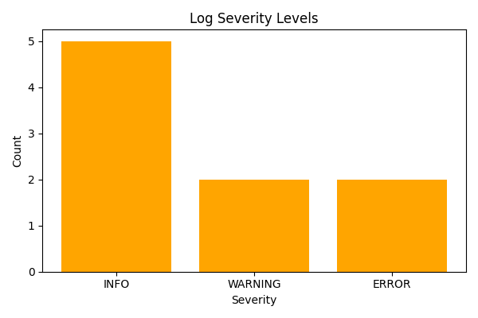

# 🔍 AI Log Analysis – DevOps Test Promotion Pipeline

Welcome to the **AI Log Analysis System** — a simulated DevOps environment designed to demonstrate CI/CD integration, automated testing, and anomaly detection in system logs using Python and GitHub Actions.

---

## 🚀 Project Summary

This project analyzes application logs to detect anomalies (e.g., error messages) and is set up with a **GitHub Actions workflow** to simulate promotion to a **Test Stage**. It includes:
- Log parsing and anomaly detection logic  
- Unit tests for validation  
- Automated GitHub workflow that installs dependencies, runs tests, and simulates deployment  
- Severity chart export using `matplotlib`

---

## 📁 File Structure

```
ai-log-analysis/
├── dev/
│   └── app.py               # Main application script
├── test/
│   └── test_app.py          # Unit tests
├── logs/
│   └── sample_logs.txt      # Sample input logs
├── .github/
│   └── workflows/
│       └── promote-to-test.yml  # GitHub Actions pipeline
├── requirements.txt         # Dependencies
├── log_severity_summary.png # Output chart image
└── README.md
```

---

## 🧠 Features

- ✅ **Log Parsing**  
  Parses log messages line-by-line and identifies lines containing key anomalies (`ERROR`, `WARNING`, `INFO`).

- ✅ **Unit Testing**  
  Uses Python’s `unittest` to verify that anomaly detection works as expected.

- ✅ **CI/CD with GitHub Actions**  
  Automatically installs dependencies, runs tests, and simulates deployment on push to `main`.

- ✅ **Severity Chart Export**  
  Creates and saves a bar chart (`log_severity_summary.png`) showing counts of INFO, WARNING, and ERROR logs.

---

## 🧪 Sample Log Anomaly Detection

The following logs:
```
INFO: System check complete
WARNING: Disk usage at 85%
ERROR: Disk space critically low
INFO: Backup scheduled
```

Will detect:
```
- WARNING: Disk usage at 85%
- ERROR: Disk space critically low
```

And generate this chart:



---

## 🔨 Running the Code Locally

1. Clone the repository  
2. Navigate to the project directory  
3. Install dependencies:
   ```bash
   pip install -r requirements.txt
   ```
4. Run the main analyzer:
   ```bash
   python dev/app.py
   ```
5. Run the unit tests:
   ```bash
   python -m unittest test/test_app.py
   ```

---

✅ This project simulates a complete DevOps flow using real tools — Python, GitHub Actions, and testable CI pipelines. Great for demos, teaching, and prototypes!
